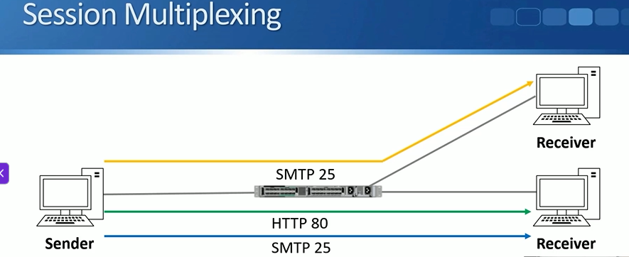
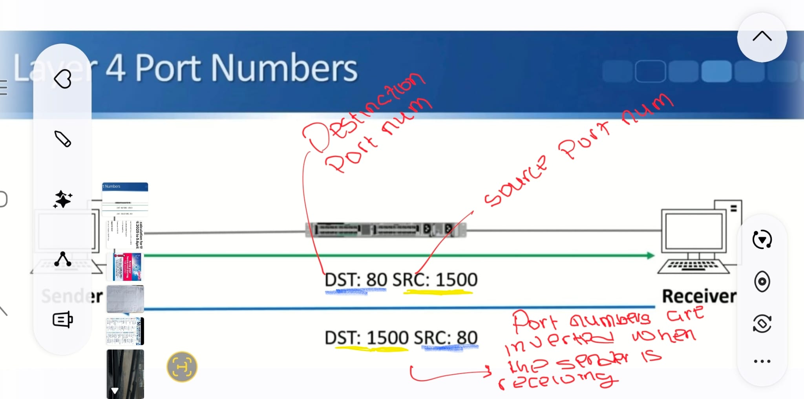
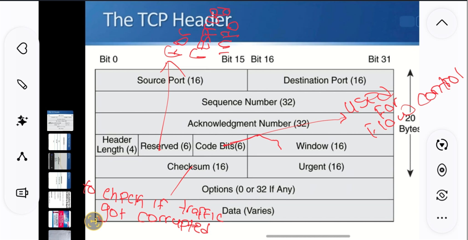
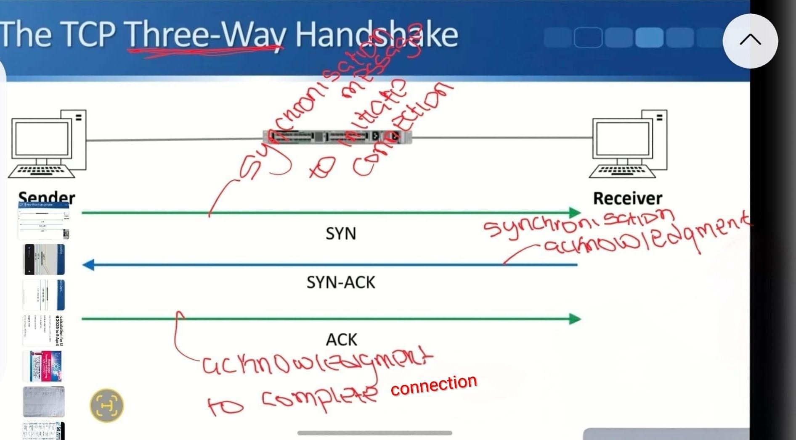
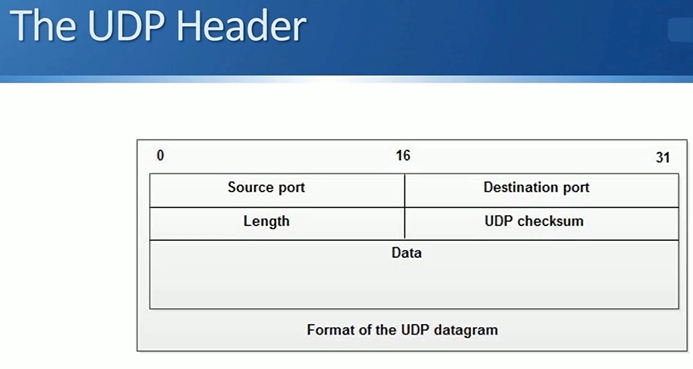

# Topic: Layer 4 Transport Layer
**Date:** 19-06-2026

**Status:** 🟢 / 🟡 / 🔴 

## What I learned:
- Provides transparent transfer of data between hosts and is responsible for flow control
- Flow control is the process by which flow of data is adjusted so that both hosts can handle it; in simple terms, or rather the way I understand it: in a multiplayer game, different players have different internet speeds, so a player might send traffic faster than the other, if flow control is enabled the receiver will have a mechanism to tell the sender to slow down the flow of data so
- Session multiplexing also takes place in layer 4, this is the process by which multiple sessions are supported by a host, the host is also able to manage traffic streams under a single link

- Another feature of the transport layer is the use of port numbers, port numbers are used to identify the type of application a data traffic is for.
  - Sender sends data traffic with source port number and destination port number, when receiver is sending back traffic, the destination port number and source port number are flipped around.
  - A type of firewall uses this to block unauthorised traffic, so it only always allows traffic from the sender to the receiver but when the receiver sends back it compares, or rather checks, if the connection was initiated by a sender or receiver, if it was initiated by a receiver then the traffic is blocked.
  - So it checks if the sender destination port number = the receiver source port number and vice versa, if they don't match it means connection was initiated by receiver so traffic is blocked.

**The two protocols in layer 4:**
The layer consists of two main protocols: TCP and UDP.

| Feature | TCP | UDP |
|---|---|---|
| Connection type | Connection-oriented, bidirectional | Connectionless |
| Reliability | Reliable (acknowledgments + resend on failure) | Unreliable (no acknowledgments) |
| Sequencing | Yes, sequence numbers keep segments in order | No |
| Flow control | Yes | No |
| Error recovery | Handled at this layer | Left to upper layers |
| Typical use | Static web applications | Real-time video and voice |

TCP header:

TCP connection setup uses a three-way handshake:

UDP header:

Developers typically use TCP due to its reliability, these are used in instances like static web applications
Real-time applications like videos and voice usually use UDP as they can't afford the extra overhead of TCP
Some use both UDP and TCP

Common applications and their destination ports:

TCP:
- FTP (21)
- SSH (22)
- Telnet (23)
- HTTP (80)
- HTTPS (443)

UDP:
- TFTP (69)
- SNMP (161)

TCP and UDP:
- DNS (53)

**Struggles/Questions:**
- What's the difference between data and traffic? It's hard to visualise when the terms are used interchangeably.