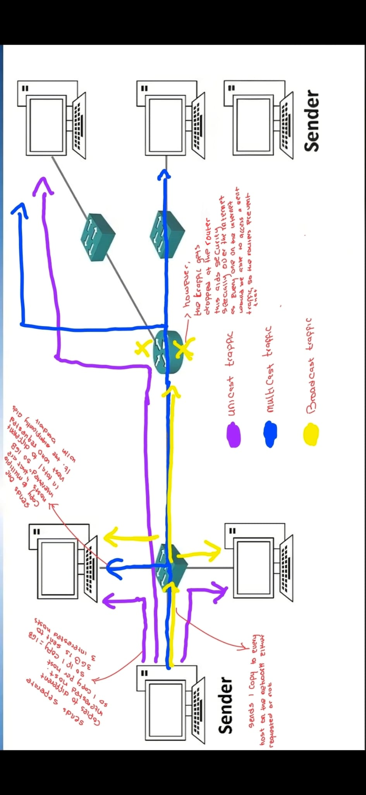
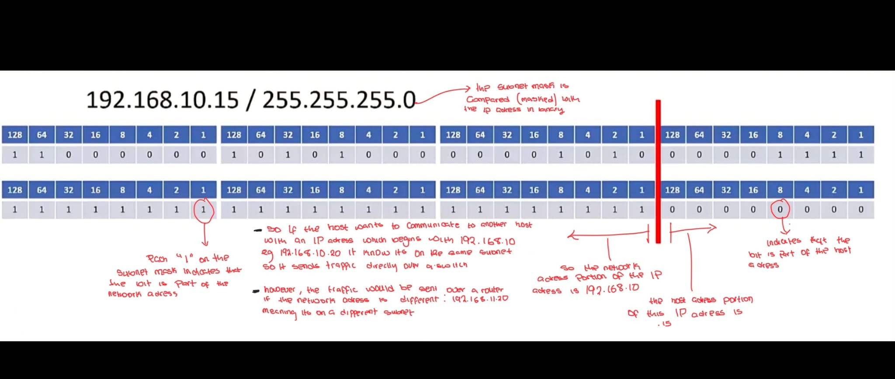
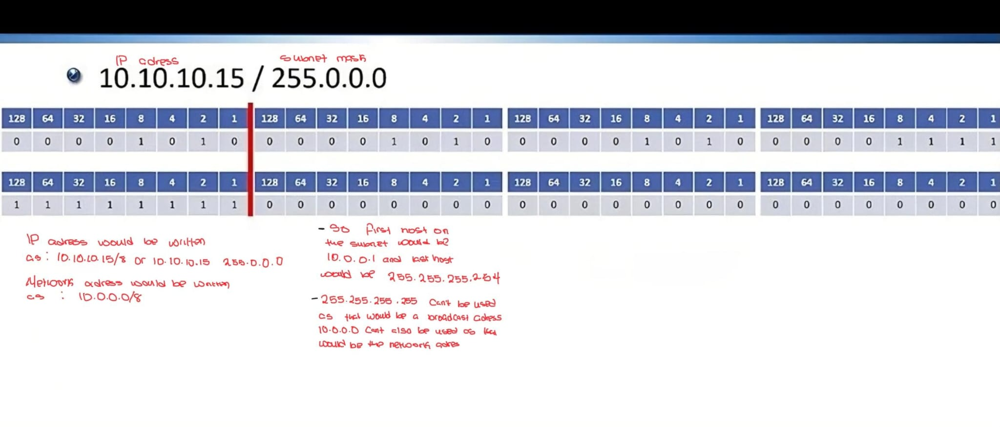

# Topic: Layer 3 Network Layer
**Date:** 20-06-2026

**Status:** 🟢 / 🟡 / 🔴

## What I Learned

### Role of the Network Layer
- The network layer is responsible for routing packets to their destination, and also for the quality of service
  - Quality of service refers to the level of service needed by a traffic, e.g. a higher level of service is needed for video streaming compared to email traffic

### Protocols
- The best known protocol in this layer is IP (Internet Protocol)
  - It is a connectionless protocol with no acknowledgments, but it could still be reliable if TCP is used in Layer 4
- Other protocols include ICMP (Internet Control Message Protocol), which is used for pinging and troubleshooting
  - IPsec is also used
- IP addressing is a logical addressing used to partition overall networks into smaller "subnets"

### Traffic Types
**The three main types of traffic are:**
- Unicast - sends traffic to one host
- Multicast - sends traffic to multiple hosts
- Broadcast - sends traffic to all hosts



| Traffic Type | How it Works |
|---|---|
| Unicast | Sends a separate copy to a particular interested host |
| Multicast | Sends 1 copy to multiple interested hosts (this is how a radio works, you only get the radio traffic when you tune into the specific frequency) |
| Broadcast | Sends to every single host on the network |

### Decimal to Binary
(Did this in my GCSEs so it was dead easy)

**236 to binary:**

| 128 | 64 | 32 | 16 | 8 | 4 | 2 | 1 |
|---|---|---|---|---|---|---|---|
| 1 | 1 | 1 | 0 | 1 | 1 | 0 | 0 |

`236` = `11101100`

**179 to binary:**

| 128 | 64 | 32 | 16 | 8 | 4 | 2 | 1 |
|---|---|---|---|---|---|---|---|
| 1 | 0 | 1 | 1 | 0 | 0 | 1 | 1 |

`179` = `10110011`

IPv4 is `32` bits long with `4` octets divided by decimal points, each octet is `8` bits, `4 x 8 = 32`

### Viewing IP Address
**To view IP address on:**
- Windows Command Prompt:
  ```diff
  + ipconfig
  ```
- Linux (via PuTTY over SSH) and Apple:
  ```diff
  + ifconfig
  ```
- Cisco IOS:
  ```diff
  + show ip interface brief
  ```
  or
  ```diff
  + show interface
  ```

### Static vs Auto
- IP addresses are manually set up on printers, servers, routers and switches
- Whereas it's automatically set up on desktops through DHCP (Dynamic Host Configuration Protocol)

Each octet is a value ranging from decimals `0` - `255`

So IP address `192.168.10.15` in binary would be:
`11000000.10101000.00001010.00001111`

### Subnetting Basics
- When traffic is sent to a host in the same subnet, it is sent via a switch
- If the receiving host is on a different subnet, it is sent via a router, so a router links different subnets together
- So the sending host needs to check if the destination IP address and subnet match, to know how to send it
  - To do this, a subnet mask is also used, which is also `32` bits long
- A host IP is divided into a network portion and a host portion, the subnet mask is used to identify the boundary

For example, where an IP address is `192.168.10.15`, and the subnet mask is `255.255.255.0`:



Subnet masks always begin with contiguous "1"s so the 1s and 0s never mix up, like `10111111.00001111.11111111.00000000` - rather it is `11111111.11111111.00000000.00000000`

### Slash Notation
- When in Cisco IOS configuration, the IP address and subnet mask is written in decimal, but it's more convenient to write as slash notation, and also when having conversations
- Where subnet mask:
  - `255.255.255.0` = `/24`
  - `255.255.0.0` = `/16`


