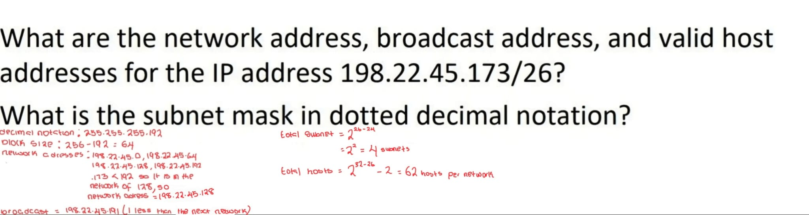
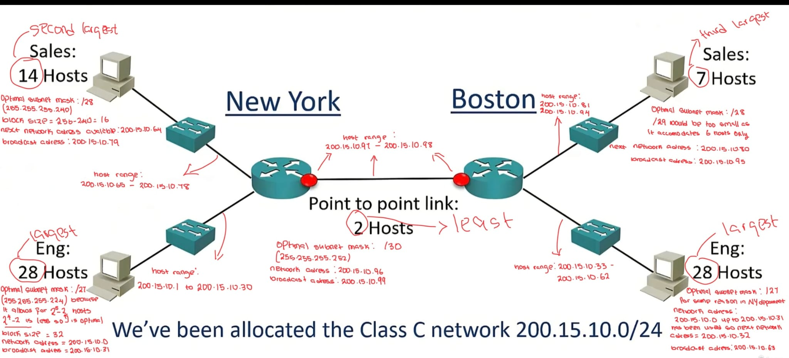

# Topic: VLSM and Subnetting Design
**Date:** 24-06-2026 - 26-06-2026

---

## VLSM (Variable Length Subnet Mask)

Early routing protocols only supported **FLSM (Fixed Length Subnet Mask)**, where all subnets had to be the same size. So if you needed a subnet for 10 hosts, every subnet in the network had to use the same mask, meaning you couldn't have one subnet with 14 hosts and another with 64.

VLSM is supported by modern protocols and allows different subnet sizes based on how many hosts are needed, so fewer addresses are wasted.

---

## Subnetting Considerations

When designing a subnet scheme, consider:
- Number of locations in the network
- Number of hosts in each location
- IP addressing requirements (different departments with different host counts)
- Appropriate subnet size for each segment, no wastage but leaving room for growth

**Design steps:**
1. Allocate a subnet size to the largest segment first
2. Allocate that subnet at the start of the address space
3. Continue down the list from largest to smallest

> In the real world it's best to design subnets with room for host growth. In the CCNA though, we do as instructed.

---

## Practice Questions

I plan to do 5 questions every day on:
- https://www.subnetting.org/
- https://subnettingpractice.com/

Practice 1 - 198.22.45.173/26

Practice 2 - Subnetting for an organisation (200.15.10.0/24)

Practice 3 - 60.0.0.0/8, given /19 - hosts and subnets

Practice 4 - 134.65.0.0/19

Practice 5 - 172.19.216.50/28

Practice 6 - 172.19.216.50/23

