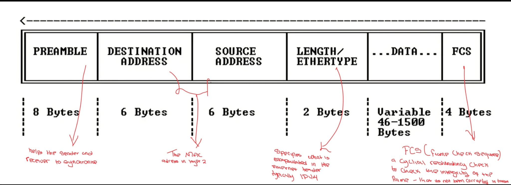

# Topic: Layer 2 - Data Link

Frames are encoded and decoded into bits; error detection and correction for the physical layer can be provided here.
Ethernet is the Layer 2 medium used on local area networks.

## Layer 2 Header

## Media Access Control
- Ethernet uses a 48-bit hexadecimal MAC address.
- The MAC address is divided into two portions:
    - The first 24 bits are dedicated to the OUI (Organisationally Unique Identifier), which identifies the manufacturer of the ethernet port. The OUI is assigned by the IEEE.
    - The last 24 bits are assigned by the manufacturer.
- The burned-in MAC address on every NIC port in the world is globally unique. The number of potential addresses is 2^48.
- There is no logical addressing in MAC addresses, so there is no need for logical allocation of addresses -- it is just a big flat space of addresses.

## Retrieving MAC Addresses
- On Windows: `ipconfig /all`
- On Linux via PuTTY with SSH connection: `ifconfig`
- On Cisco router: `show interface`

## Physical Layer
The OSI physical layer conveys the bit stream through electrical impulses, light, or radio signals at the electrical and mechanical level.

It provides the means of transmitting data via cables, interface cards, and other physical aspects.

Ethernet LAN connections can be carried over coaxial cable (no longer used), twisted copper cable, fibre cable, or wireless.

### Copper UTP (Unshielded Twisted Pair)
- Commonly used to connect desktop computers to switches.
- Connector type is RJ-45 and maximum length is 100 metres.

Cable categories:
- **Cat 5** -- 100 Mbps. This was sufficient at the time of production, but progressively through the years, network devices required higher bandwidth so the maximum had to be upgraded.
- **Cat 5e** -- 1 Gbps
- **Cat 6** -- 10 Gbps
- **Cat 6a** -- 10 Gbps
- **Cat 7** -- 10 Gbps
- **Cat 8** -- 40 Gbps

Copper cables can be wired as straight-through or crossover:
- **Straight-through cables** are used to connect end devices such as a PC or router to a switch.
- **Crossover cables** are used to connect devices directly together -- usually two devices of the same type.

Modern switches support Auto MDI-X, where transmit and receive signals are automatically reconfigured to yield the expected result.

### Fibre Optic
Fibre optic cables can be used to support longer distances or higher bandwidth requirements, for instance between separate buildings on a campus or for switch-to-switch connections inside a building.

- Both multimode and single-mode fibre can be used.
- Single-mode supports higher bandwidth and longer distances but is more expensive.
- Copper RJ-45 connectors plug directly into the switch, while fibre optic cables require a transceiver.

### PoE (Power over Ethernet)
PoE is used to deliver power to PoE-capable devices.

- With standard switches, a separate power supply would be required for each device.
- With a PoE switch, power is sent over the standard network cable, making PoE switches preferred over standard switches.
- If a wireless access point is located in an area with little power access, a power injector can be used -- it supplies PoE over the ethernet cable up to 100 metres.